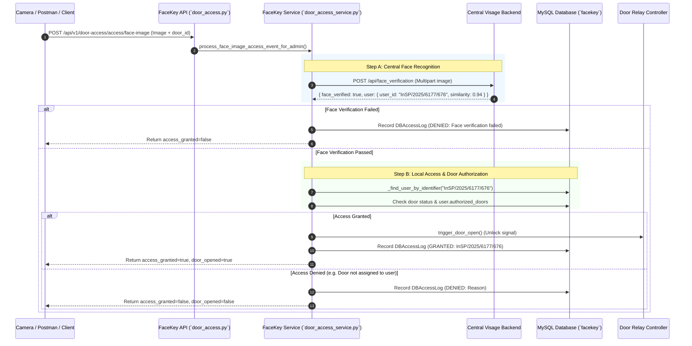

# FaceKey Door Access Control - System Architecture & API Specification

## 1. System Overview

**FaceKey** is an edge-based door access control system integrated with the central **Visage** facial recognition server. 

When a person approaches a door monitored by a camera:
1. The camera/client sends the captured face image and target `door_id` to FaceKey backend.
2. FaceKey forwards the image to the central **Visage API** for face matching.
3. Visage identifies the person and returns their unique **InSP Employee Number** (e.g., `InSP/2025/6177/676`) and `similarity_score`.
4. FaceKey queries its local database to verify if this employee has authorization for the specified door.
5. If authorized, FaceKey triggers the physical door mechanism to unlock and logs a **GRANTED** event. If unauthorized, access is denied and a **DENIED** log entry is recorded with the exact reason.

---

## 2. End-to-End Sequence Workflow



---

## 3. Core Authorization Rules

For access to be **GRANTED**, all of the following conditions must be met:

> [!IMPORTANT]
> 1. **User Existence**: User with matching InSP ID must exist in local database.
> 2. **Account Active**: `user.is_active` must be `true`.
> 3. **Face Registered**: `user.face_registered` must be `true`.
> 4. **Similarity Threshold**: `similarity_score >= 0.60` (configurable in [.env](file:///e:/FaceKey/backend/.env#L15)).
> 5. **Door Online**: Door status must be `online` (not `offline` or `error`).
> 6. **Door Authorized**: The requested `door_id` must be present in `user.authorized_doors` list.

---

## 4. API Endpoints Specification

### Base Path
`http://localhost:8000/api/v1/door-access`

---

### Endpoint 1: Face Image Access Processing (Primary Camera Flow)

Processes face recognition from a camera image, verifies identity with Visage, and evaluates door authorization.

- **HTTP Method**: `POST`
- **Path**: `/access/face-image`
- **Content-Type**: `multipart/form-data`
- **Code Reference**: [door_access.py:L1108](file:///e:/FaceKey/backend/src/app/api/v1/door_access.py#L1108)

#### Request Headers
| Header | Type | Required | Description |
| :--- | :--- | :--- | :--- |
| `X-Admin-Id` | String | Yes | Admin ID executing or auditing the request (e.g., `SUPER001`) |

#### Request Form Data Parameters
| Field | Type | Required | Description |
| :--- | :--- | :--- | :--- |
| `door_id` | String | Yes | Unique ID of the target door (e.g., `DOOR_001`) |
| `camera_id` | String | No | Identifier of the camera capturing the event |
| `image` | File | Yes | Image file (`.jpg`, `.jpeg`, `.png`, `.webp`, max size 5MB) |

#### Example Response (Access Granted)
```json
{
  "success": true,
  "event_logged": true,
  "face_verified": true,
  "access_granted": true,
  "door_opened": true,
  "message": "Access granted for Kisanja",
  "matched_user_id_from_visage": "InSP/2025/6177/676",
  "visage_similarity_score": 0.94,
  "visage_threshold_used": 0.6,
  "door_id": "DOOR_001",
  "camera_id": "CAM_MAIN_ENTRANCE",
  "door": {
    "id": "DOOR_001",
    "name": "Main Entrance Gate",
    "status": "online",
    "building_id": "BLD_HQ"
  },
  "user": {
    "id": "InSP/2025/6177/676",
    "name": "Kisanja",
    "department": "Engineering",
    "role": "employee",
    "authorized_doors": ["DOOR_001", "DOOR_002"]
  }
}
```

#### Example Response (Access Denied - Door Not Authorized)
```json
{
  "success": true,
  "event_logged": true,
  "face_verified": true,
  "access_granted": false,
  "door_opened": false,
  "message": "User not authorized for this door",
  "reason": "User not authorized for this door",
  "matched_user_id_from_visage": "InSP/2025/6177/676",
  "visage_similarity_score": 0.94,
  "door_id": "DOOR_RESTRICTED_LAB"
}
```

---

### Endpoint 2: Pre-Recognized Camera Event

Used by smart edge cameras that perform face recognition on-device and send the resolved InSP user ID directly.

- **HTTP Method**: `POST`
- **Path**: `/access/camera-event`
- **Content-Type**: `application/json`
- **Code Reference**: [door_access.py:L1165](file:///e:/FaceKey/backend/src/app/api/v1/door_access.py#L1165)

#### Request Headers
| Header | Type | Required | Description |
| :--- | :--- | :--- | :--- |
| `X-Admin-Id` | String | Yes | Admin ID |

#### Request Body
```json
{
  "door_id": "DOOR_001",
  "user_id": "InSP/2025/6177/676",
  "similarity_score": 0.91,
  "camera_id": "EDGE_CAM_01"
}
```

#### Response
```json
{
  "success": true,
  "event_logged": true,
  "access_granted": true,
  "door_opened": true,
  "message": "Access granted for Kisanja",
  "reason": "",
  "door": { "id": "DOOR_001", "name": "Main Gate" },
  "user": { "id": "InSP/2025/6177/676", "name": "Kisanja" }
}
```

---

### Endpoint 3: Manual Door Access Check

Checks whether a specific employee (InSP ID) has access to a specific door without triggering physical unlock or external face recognition.

- **HTTP Method**: `POST`
- **Path**: `/access/check`
- **Query Parameters**: `user_id`, `door_id`
- **Code Reference**: [door_access.py:L1058](file:///e:/FaceKey/backend/src/app/api/v1/door_access.py#L1058)

#### Request Headers
| Header | Type | Required | Description |
| :--- | :--- | :--- | :--- |
| `X-Admin-Id` | String | Yes | Admin ID |

#### Example Request
`POST /api/v1/door-access/access/check?user_id=InSP/2025/6177/676&door_id=DOOR_001`

#### Response
```json
{
  "authorized": true,
  "user": { "id": "InSP/2025/6177/676", "name": "Kisanja" },
  "door": { "id": "DOOR_001", "name": "Main Entrance" }
}
```

---

### Endpoint 4: Direct Door Unlock Trigger (Manual Override)

Unlocks a door directly (for admin overrides or emergency release).

- **HTTP Method**: `POST`
- **Path**: `/doors/{door_id}/open`
- **Code Reference**: [door_access.py:L669](file:///e:/FaceKey/backend/src/app/api/v1/door_access.py#L669)

#### Request Headers
| Header | Type | Required | Description |
| :--- | :--- | :--- | :--- |
| `X-Admin-Id` | String | Yes | Admin ID executing manual unlock |

#### Response
```json
{
  "success": true,
  "message": "Door unlocked successfully",
  "door_id": "DOOR_001",
  "opened_at": "2026-08-17T12:50:00.000Z"
}
```

---

### Endpoint 5 & 6: Email OTP Access Fallback (Demo / Alternative)

Allows requesting and verifying an email OTP to unlock a door if face recognition is unavailable.

- **Request OTP**: `POST /access/otp/request` ([door_access.py:L1167](file:///e:/FaceKey/backend/src/app/api/v1/door_access.py#L1167))
- **Verify OTP**: `POST /access/otp/verify` ([door_access.py:L1194](file:///e:/FaceKey/backend/src/app/api/v1/door_access.py#L1194))

---

## 5. Key Python Code Functions Reference

| Component / Function | File Path | Line Range | Purpose |
| :--- | :--- | :--- | :--- |
| `verify_face_with_visage()` | [door_access_service.py](file:///e:/FaceKey/backend/src/app/services/door_access_service.py#L453) | L453 - L546 | Calls Visage HTTP API, extracts `matched_user_id` and similarity score |
| `process_face_image_access_event_for_admin()` | [door_access_service.py](file:///e:/FaceKey/backend/src/app/services/door_access_service.py#L547) | L547 - L645 | Orchestrates face verification + door access evaluation |
| `process_camera_access_event()` | [door_access_service.py](file:///e:/FaceKey/backend/src/app/services/door_access_service.py#L1614) | L1614 - L1680 | Evaluates user authorization, threshold, and door status |
| `_find_user_by_identifier()` | [door_access_service.py](file:///e:/FaceKey/backend/src/app/services/door_access_service.py#L1586) | L1586 - L1613 | Normalizes InSP strings (e.g. `InSP/2025/6177/676`) |
| `check_user_access()` | [door_access_service.py](file:///e:/FaceKey/backend/src/app/services/door_access_service.py#L1522) | L1522 - L1540 | Validates user activity, face registration, and authorized door list |

---

## 6. Database Table Reference

- **`users`**: Stores employee profiles, `id` (InSP number), `face_registered`, `is_active`, and `authorized_doors` (JSON array of door IDs).
- **`doors`**: Stores door metadata, `id`, `building_id`, `status` (`online`, `offline`, `error`).
- **`access_logs`**: Stores complete audit log for every attempt (`GRANTED` / `DENIED`, user ID, door ID, similarity score, timestamp).
- **`admin_users`**: Stores administrator accounts (`SUPER_ADMIN`, `TENANT_ADMIN`, `BUILDING_ADMIN`).
